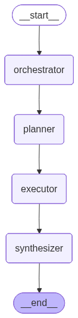

# Agent Account Advisor - Itaú

Sistema multi-agente de assessoria bancária inteligente construído com LangGraph, FastAPI e LangChain.

## Arquitetura

O sistema utiliza um grafo de execução com 4 nós principais:



| Nó | Responsabilidade |
|----|-----------------|
| **Orchestrator** | Classifica a intenção do cliente e analisa o contexto da solicitação |
| **Planner** | Decompõe a solicitação em subtarefas e seleciona os agentes necessários |
| **Executor** | Despacha tarefas para os agentes especialistas com resolução de dependências |
| **Synthesizer** | Consolida resultados em uma resposta única e coerente para o cliente |

### Agentes Especialistas

- **agente_consulta** — Consulta dados bancários (saldo, extrato, transações) via ferramentas SQL
- **agente_analise** — Análise de padrões financeiros e recomendações personalizadas
- **agente_apoio** — Informações contextuais e temporais (datas, calendário bancário)

### Ferramentas

- **search_database_schema** — Consulta a estrutura das tabelas do banco
- **select_database** — Executa queries SELECT no PostgreSQL (bloqueio de operações de escrita)

## Stack Tecnológica

- **Framework API**: FastAPI
- **Orquestração de Agentes**: LangGraph + LangChain
- **LLM Providers**: OpenAI, AWS Bedrock, Google Gemini, Ollama (via ProviderFactory)
- **Banco de Dados**: PostgreSQL (SQLAlchemy)
- **Persistência de Estado**: Redis (LangGraph Checkpointer)
- **Observabilidade**: Langfuse
- **Storage**: MinIO (S3-compatible)
- **Analytics**: ClickHouse

## Estrutura do Projeto

```
agent-advisor/
├── src/
│   ├── main.py                          # FastAPI app
│   ├── config/
│   │   └── settings.py                  # Configurações via env vars
│   ├── adapters/
│   │   ├── routes/
│   │   │   └── conversation_route.py    # Endpoint da API
│   │   └── schemas/
│   │       ├── conversation_model_request.py
│   │       └── conversation_model_response.py
│   ├── infrastructure/
│   │   ├── postgresql/
│   │   │   ├── connection.py            # SQLAlchemy connection
│   │   │   ├── connection_database.py   # Interface abstrata
│   │   │   └── connection_database_factory.py
│   │   ├── redis/
│   │   │   └── checkpointer.py          # LangGraph Redis checkpointer
│   │   └── provider_factory/
│   │       ├── connection_models_factory.py  # Factory de LLMs
│   │       ├── openai.py
│   │       ├── ollama.py
│   │       ├── aws_bedrock.py
│   │       └── google.py
│   ├── utils/
│   │   ├── prompts.py                   # Todos os prompts do sistema
│   │   └── display_graph.py
│   └── workflow_agentic/
│       ├── state.py                     # TypedDict do estado do grafo
│       ├── graph.py                     # Construção e compilação do grafo
│       ├── agents/
│       │   └── agents.py               # Implementação dos agentes
│       ├── nodes/
│       │   └── node.py                 # Funções dos nós do grafo
│       └── tools/
│           └── tool_database.py        # Ferramentas de consulta SQL
├── dockerfile
└── __init__.py
```

## Configuração

### Variáveis de Ambiente

Crie um arquivo `.env` na raiz do projeto:

```env
# LLM Provider (openai | ollama | aws_bedrock | google_gemini)
PROVIDER_LLM=openai
OPENAI_API_KEY=sk-...

# PostgreSQL
DB_HOST=localhost
DB_PORT=5432
DB_NAME=person_info
DB_USER=postgres
DB_PASSWORD=admin

# Redis
REDIS_URL=redis://:myredissecret@localhost:6379/0
```

### Pré-requisitos

- Python 3.12+
- Docker e Docker Compose

## Execução

### Com Docker (recomendado)

```bash
docker compose up --build
```

Isso sobe todos os serviços: API, PostgreSQL, Redis, Langfuse, ClickHouse e MinIO.

### Local (desenvolvimento)

```bash
python -m venv env
source env/bin/activate
pip install -r requirements.txt

# Subir dependências
docker compose up database-postgresql redis -d

# Rodar a API
cd agent-advisor
uvicorn src.main:app --host 0.0.0.0 --port 8000 --reload
```

## API

### POST `/ms_agent_server/V1/agent_conversation/`

**Request:**

```json
{
  "message_input": "Qual meu saldo atual?",
  "client_id": "a1b2c3d4-e5f6-4a7b-8c9d-0e1f2a3b4c5d",
  "session_id": "sess-001",
  "interaction_id": "int-001"
}
```

**Response:**

```json
{
  "message_output": "Seu saldo disponível é de R$ 4.520,75...",
  "client_id": "a1b2c3d4-e5f6-4a7b-8c9d-0e1f2a3b4c5d",
  "session_id": "sess-001",
  "interaction_id": "int-001"
}
```

## Persistência de Estado

O sistema utiliza Redis para persistir o estado das conversas. Cada `session_id` mantém o histórico completo, permitindo conversas multi-turno com contexto.

Se o Redis não estiver disponível, o sistema automaticamente usa `MemorySaver` (in-memory) como fallback.

## Segurança

- Queries SQL bloqueiam operações de escrita (INSERT, UPDATE, DELETE, DROP, ALTER, etc.)
- Dados sensíveis são mascarados nas respostas (números de conta, CPF de terceiros)
- O provider LLM é configurado exclusivamente via variáveis de ambiente

## Dados de Demonstração

Para popular o banco com dados de exemplo, execute o SQL abaixo no PostgreSQL:

```sql
-- Criação da tabela de transações
CREATE TABLE IF NOT EXISTS transactions (
    id SERIAL PRIMARY KEY,
    client_id UUID NOT NULL,
    client_name VARCHAR(100) NOT NULL,
    transaction_date DATE NOT NULL,
    description VARCHAR(255) NOT NULL,
    category VARCHAR(50) NOT NULL,
    type VARCHAR(10) NOT NULL CHECK (type IN ('debito', 'credito')),
    amount DECIMAL(12, 2) NOT NULL,
    payment_method VARCHAR(30) NOT NULL,
    establishment VARCHAR(150),
    balance_after DECIMAL(12, 2) NOT NULL
);

-- Criação da tabela de contas
CREATE TABLE IF NOT EXISTS accounts (
    id SERIAL PRIMARY KEY,
    client_id UUID UNIQUE NOT NULL,
    client_name VARCHAR(100) NOT NULL,
    account_number VARCHAR(20) NOT NULL,
    agency VARCHAR(10) NOT NULL,
    balance DECIMAL(12, 2) NOT NULL DEFAULT 0,
    overdraft_limit DECIMAL(12, 2) NOT NULL DEFAULT 0,
    account_type VARCHAR(20) NOT NULL DEFAULT 'corrente',
    updated_at TIMESTAMP DEFAULT CURRENT_TIMESTAMP
);

-- Inserção de contas
INSERT INTO accounts (client_id, client_name, account_number, agency, balance, overdraft_limit, account_type) VALUES
('a1b2c3d4-e5f6-4a7b-8c9d-0e1f2a3b4c5d', 'Maria Silva', '12345-6', '0001', 4520.75, 2000.00, 'corrente'),
('b2c3d4e5-f6a7-4b8c-9d0e-1f2a3b4c5d6e', 'João Santos', '78901-2', '0001', 1230.40, 1000.00, 'corrente'),
('c3d4e5f6-a7b8-4c9d-0e1f-2a3b4c5d6e7f', 'Ana Oliveira', '34567-8', '0042', 8750.00, 5000.00, 'corrente');

-- Transações da Maria Silva
INSERT INTO transactions (client_id, client_name, transaction_date, description, category, type, amount, payment_method, establishment, balance_after) VALUES
('a1b2c3d4-e5f6-4a7b-8c9d-0e1f2a3b4c5d', 'Maria Silva', '2026-06-23', 'Compra Drogaria São Paulo', 'farmacia', 'debito', 87.50, 'debito', 'Drogaria São Paulo - Unidade Centro', 4520.75),
('a1b2c3d4-e5f6-4a7b-8c9d-0e1f2a3b4c5d', 'Maria Silva', '2026-06-22', 'Supermercado Extra', 'mercado', 'debito', 342.18, 'credito', 'Extra Hipermercado - Pinheiros', 4608.25),
('a1b2c3d4-e5f6-4a7b-8c9d-0e1f2a3b4c5d', 'Maria Silva', '2026-06-21', 'Posto Shell Av. Paulista', 'gasolina', 'debito', 215.00, 'debito', 'Posto Shell - Av. Paulista 1500', 4950.43),
('a1b2c3d4-e5f6-4a7b-8c9d-0e1f2a3b4c5d', 'Maria Silva', '2026-06-20', 'iFood Restaurante', 'alimentacao', 'debito', 56.90, 'credito', 'iFood - Restaurante Sabor Caseiro', 5165.43),
('a1b2c3d4-e5f6-4a7b-8c9d-0e1f2a3b4c5d', 'Maria Silva', '2026-06-19', 'Netflix Assinatura', 'assinatura', 'debito', 39.90, 'credito', 'Netflix Serviços Digitais', 5222.33),
('a1b2c3d4-e5f6-4a7b-8c9d-0e1f2a3b4c5d', 'Maria Silva', '2026-06-18', 'PIX Recebido - Salário', 'renda', 'credito', 6500.00, 'pix', NULL, 5262.23),
('a1b2c3d4-e5f6-4a7b-8c9d-0e1f2a3b4c5d', 'Maria Silva', '2026-06-17', 'Conta de Luz ENEL', 'moradia', 'debito', 189.50, 'boleto', 'ENEL Distribuição SP', -1237.77),
('a1b2c3d4-e5f6-4a7b-8c9d-0e1f2a3b4c5d', 'Maria Silva', '2026-06-15', 'Uber Viagem', 'transporte', 'debito', 32.40, 'credito', 'Uber do Brasil', -1048.27),

-- Transações do João Santos
('b2c3d4e5-f6a7-4b8c-9d0e-1f2a3b4c5d6e', 'João Santos', '2026-06-23', 'Mercado Pão de Açúcar', 'mercado', 'debito', 178.90, 'debito', 'Pão de Açúcar - Moema', 1230.40),
('b2c3d4e5-f6a7-4b8c-9d0e-1f2a3b4c5d6e', 'João Santos', '2026-06-22', 'Farmácia Raia', 'farmacia', 'debito', 45.60, 'debito', 'Droga Raia - Unidade Vila Mariana', 1409.30),
('b2c3d4e5-f6a7-4b8c-9d0e-1f2a3b4c5d6e', 'João Santos', '2026-06-21', 'Posto Ipiranga BR', 'gasolina', 'debito', 180.00, 'debito', 'Posto Ipiranga - Rua Augusta', 1454.90),
('b2c3d4e5-f6a7-4b8c-9d0e-1f2a3b4c5d6e', 'João Santos', '2026-06-20', 'Spotify Premium', 'assinatura', 'debito', 21.90, 'credito', 'Spotify AB', 1634.90),
('b2c3d4e5-f6a7-4b8c-9d0e-1f2a3b4c5d6e', 'João Santos', '2026-06-19', 'Aluguel Apartamento', 'moradia', 'debito', 1800.00, 'boleto', 'Imobiliária Lopes', 1656.80),
('b2c3d4e5-f6a7-4b8c-9d0e-1f2a3b4c5d6e', 'João Santos', '2026-06-18', 'PIX Recebido - Freelance', 'renda', 'credito', 2200.00, 'pix', NULL, 3456.80),
('b2c3d4e5-f6a7-4b8c-9d0e-1f2a3b4c5d6e', 'João Santos', '2026-06-16', 'Rappi Mercado', 'mercado', 'debito', 95.30, 'credito', 'Rappi - Mercado Express', 1256.80),
('b2c3d4e5-f6a7-4b8c-9d0e-1f2a3b4c5d6e', 'João Santos', '2026-06-14', 'Cinema Cinemark', 'lazer', 'debito', 62.00, 'debito', 'Cinemark - Shopping Ibirapuera', 1352.10),

-- Transações da Ana Oliveira
('c3d4e5f6-a7b8-4c9d-0e1f-2a3b4c5d6e7f', 'Ana Oliveira', '2026-06-23', 'Posto BR Rede', 'gasolina', 'debito', 250.00, 'debito', 'Posto BR - Rod. Raposo Tavares', 8750.00),
('c3d4e5f6-a7b8-4c9d-0e1f-2a3b4c5d6e7f', 'Ana Oliveira', '2026-06-22', 'Atacadão Compras', 'mercado', 'debito', 520.45, 'debito', 'Atacadão - Unidade Osasco', 9000.00),
('c3d4e5f6-a7b8-4c9d-0e1f-2a3b4c5d6e7f', 'Ana Oliveira', '2026-06-21', 'Drogasil Medicamentos', 'farmacia', 'debito', 132.80, 'credito', 'Drogasil - Shopping Eldorado', 9520.45),
('c3d4e5f6-a7b8-4c9d-0e1f-2a3b4c5d6e7f', 'Ana Oliveira', '2026-06-20', 'Amazon Prime', 'assinatura', 'debito', 14.90, 'credito', 'Amazon Serviços', 9653.25),
('c3d4e5f6-a7b8-4c9d-0e1f-2a3b4c5d6e7f', 'Ana Oliveira', '2026-06-19', 'PIX Recebido - Salário', 'renda', 'credito', 9800.00, 'pix', NULL, 9668.15),
('c3d4e5f6-a7b8-4c9d-0e1f-2a3b4c5d6e7f', 'Ana Oliveira', '2026-06-18', 'Condomínio Residencial', 'moradia', 'debito', 850.00, 'boleto', 'Cond. Res. Jardins', -131.85),
('c3d4e5f6-a7b8-4c9d-0e1f-2a3b4c5d6e7f', 'Ana Oliveira', '2026-06-17', 'Academia SmartFit', 'saude', 'debito', 99.90, 'debito', 'Smart Fit - Unidade Faria Lima', 718.15),
('c3d4e5f6-a7b8-4c9d-0e1f-2a3b4c5d6e7f', 'Ana Oliveira', '2026-06-15', 'Restaurante Outback', 'alimentacao', 'debito', 185.00, 'credito', 'Outback Steakhouse - Morumbi', 818.05);
```

### Categorias disponíveis

| Categoria | Descrição |
|-----------|-----------|
| farmacia | Drogarias e farmácias |
| mercado | Supermercados e atacadões |
| gasolina | Postos de combustível |
| alimentacao | Restaurantes e delivery |
| assinatura | Serviços recorrentes (streaming, apps) |
| moradia | Aluguel, condomínio, contas de consumo |
| transporte | Uber, táxi, transporte público |
| lazer | Cinema, parques, entretenimento |
| saude | Academias, consultas, exames |
| renda | Salário, freelance, transferências recebidas |

### Clientes de demonstração

| client_id (UUID v4) | Nome | Perfil |
|------|------|--------|
| `a1b2c3d4-e5f6-4a7b-8c9d-0e1f2a3b4c5d` | Maria Silva | Assalariada, gastos moderados, usa iFood e streaming |
| `b2c3d4e5-f6a7-4b8c-9d0e-1f2a3b4c5d6e` | João Santos | Freelancer, renda variável, aluguel alto |
| `c3d4e5f6-a7b8-4c9d-0e1f-2a3b4c5d6e7f` | Ana Oliveira | Salário alto, gastos com mercado e moradia elevados |

## Serviços (Docker Compose)

| Serviço | Porta | Descrição |
|---------|-------|-----------|
| agent-advisor | 8000 | API FastAPI |
| database-postgresql | 5432 | PostgreSQL 17 |
| redis | 6379 | Redis 7 (persistência de estado) |
| langfuse-web | 3000 | Langfuse UI (observabilidade) |
| clickhouse | 8123 | ClickHouse (analytics) |
| minio | 9090 | MinIO (object storage) |
